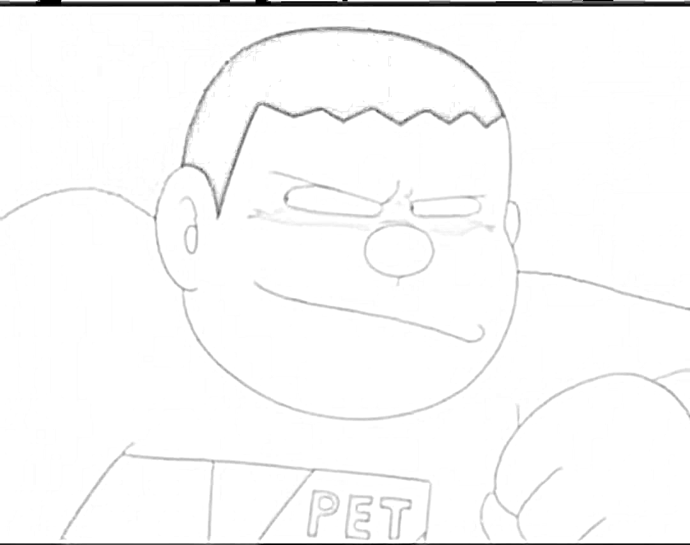

# 🖼️ Image to Pencil Sketch Converter 🎨

Easily transform your photos into beautiful pencil sketches using Python and OpenCV.

---

## 📸 Demo



> Example: An original image turned into a pencil sketch using basic image processing techniques.

---

## 🚀 Features

- Convert JPG or PNG images to pencil sketches
- Utilizes OpenCV for:
  - Grayscale conversion
  - Image inversion
  - Gaussian blurring
  - Sketch creation via image division
- Lightweight, fast, and beginner-friendly

---

## 🧠 How It Works

1. Convert the image to grayscale
2. Invert the grayscale image
3. Apply Gaussian blur to the inverted image
4. Invert the blurred image again
5. Blend the original grayscale with the final inverted blur using `cv2.divide`

---

## 🛠️ Requirements

- Python 3.x
- OpenCV library

Install dependencies:

```bash
pip install opencv-python


